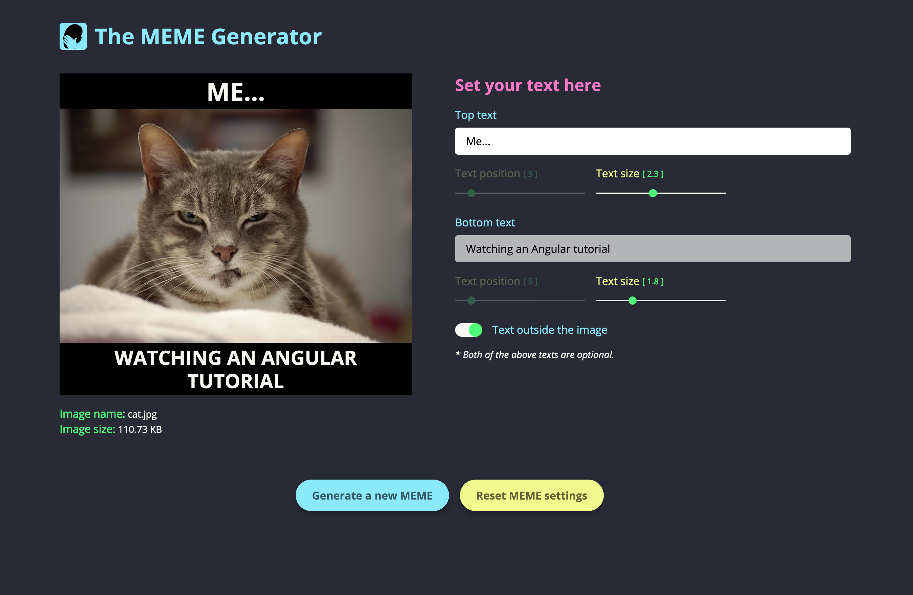

# React Meme Generator

Generate your meme here:(https://pd-meme-generator.netlify.app/).

- React JS
- React Context API
- React Hooks useState, useEffect, useContext, useReducer
- Styled Components
- URL interface (Web APIs)
- HTML to Image

